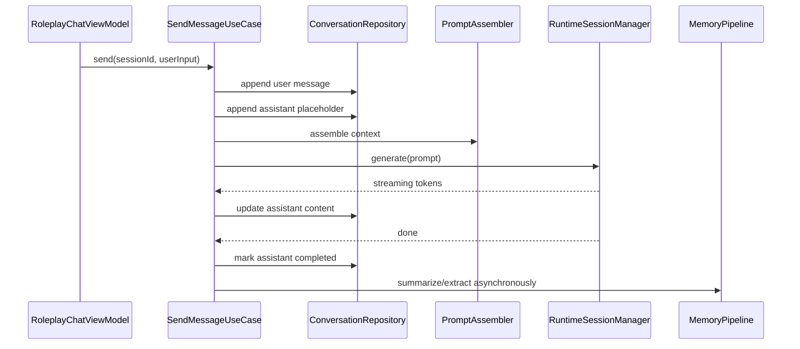
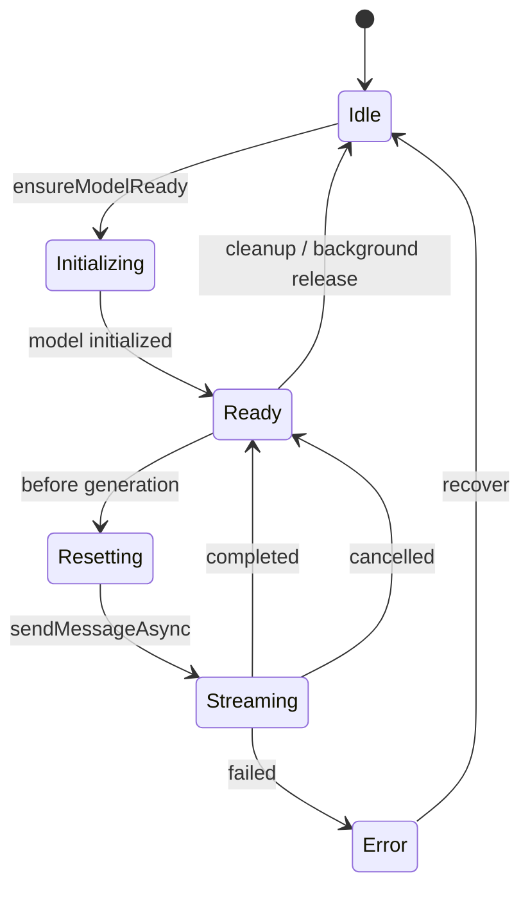

# 本地 Roleplay 聊天 App 开发规格

## 文档定位

这份文档是 [local-roleplay-chat-app-plan.md](./local-roleplay-chat-app-plan.md) 的实现级补充，目标不是再次讨论方向，而是把方向固化成可以直接指导开发的技术规格。

阅读顺序建议如下：

1. 先读方案文档，理解目标边界和阶段计划。
2. 再读本规格文档，按这里的模块边界、数据结构、接口和提交顺序进入实际开发。

本规格默认面向 Android 第一阶段实现，不承诺 iOS 同步开发。

## 1. 先固定的技术决策

### 1.1 主导航不再建立在 Task/CustomTask 上

现有主流程是围绕 `Task` 和 `CustomTask` 展开的，`Task` 的天然心智模型是“一个功能 + 多个模型 + 一个任务屏幕”。这适合 gallery 展示，不适合 roleplay 产品。

因此需要明确：

- roleplay 主路径不再注册为新的 `CustomTask`
- roleplay 页面不再以 `Task` 作为核心业务对象
- 旧 `Task`/`CustomTask` 体系只保留给 legacy gallery 流程

这意味着 roleplay 功能应作为单独 feature 进入 `NavHost`，而不是在 `HomeScreen` 上新增一个 task tile 后继续沿用原来的模型页和 task 页。

### 1.2 聊天状态不再挂在 model.name 上

现有 `ChatViewModel` 使用 `messagesByModel` 管理消息，这与 roleplay 会话模型冲突。新的主状态必须改成按 `sessionId` 装载、写回和恢复。

强制决策如下：

- 会话是第一业务主键
- 角色是第二业务主键
- 模型是运行时附属对象，而不是消息宿主

### 1.3 会话运行时采用“持久化真相 + 会话内存缓存”模型

LiteRT `Conversation` 是进程内对象，当前工程中没有现成的“从历史消息重建 conversation”能力。运行时必须接受这个约束。

因此第一阶段采取以下策略：

- 本地数据库中的 Session/Message/Memory 才是唯一真相源
- LiteRT conversation 只作为单次生成时的运行时容器
- 每次发送消息前都按当前 session 数据重新组装 prompt
- 不依赖进程内 conversation 作为长期上下文来源

这意味着 v1 推荐使用“每轮重置 conversation + 注入摘要/最近消息”的稳态方案，而不是尝试把多轮状态只保存在运行时内存里。

### 1.4 持久化方案默认选 Room

当前工程已有：Compose、Hilt、DataStore、protobuf、KSP、Moshi、kotlinx.serialization，但没有数据库依赖。

第一阶段默认引入 Room，原因如下：

- 消息是高频追加写入
- 会话页需要排序、过滤、分页
- 记忆需要按 role/session/category 检索
- 后续一定会遇到导出、归档、搜索和统计

只有在极端赶进度时，才允许退化为 proto-only MVP；但即便退化，接口边界仍要按 Room 设计。

### 1.5 现有 UI 只复用到组件层，不复用到页面壳层

代码调研结果已经足够明确：

- `ChatPanel.kt` 和 `MessageInputText.kt` 可作为可复用组件基础
- `ChatMessage.kt` 的多态消息 UI 模型可部分复用
- `ChatView.kt` 和 `LlmChatScreen.kt` 不能作为 roleplay 主页面直接复用

原因是：

- `ChatView.kt` 直接耦合 `Task`、`selectedModel`、`ModelPageAppBar` 和 `cleanupModel`
- `LlmChatScreen.kt` 直接依赖 `taskId` 与 task 体系

结论：

- 复用 `ChatPanel`、`MessageInputText`、消息体组件
- 新建 `RoleplayChatScreen`、`RoleplayChatViewModel`、`RoleplayTopBar`
- 不在 roleplay 主链路里继续使用 `ChatView` 作为页面壳

### 1.6 新包隔离与打包要求

这个项目在产品层面必须被当成一个新的 app，而不是对原有 `Google AI Edge Gallery` 做一次同包升级。任何“先复用原包名，后面再改”的策略都会导致后续返工，因为应用标识会渗透到构建、Manifest、OAuth、Firebase、通知、缓存和导入目录。

最低要求如下：

- 不复用原 `applicationId`
- 不复用原 `namespace`
- 不复用原 deep link scheme
- 不复用原 OAuth redirect scheme
- 不复用原 Firebase 工程与 `google-services.json`
- 不复用原通知 channel id 与下载通知文案
- 不复用原本地缓存文件名与导入目录名

#### 1.6.1 当前工程里已确认的原产品标识

当前工程存在以下原产品标识，需要在前置 PR 中统一替换：

| 类型 | 当前值 | 位置 | 处理要求 |
| --- | --- | --- | --- |
| namespace | `com.google.ai.edge.gallery` | `Android/src/app/build.gradle.kts` | 改成新的代码根包 |
| applicationId | `com.google.aiedge.gallery` | `Android/src/app/build.gradle.kts` | 改成新的发布包名 |
| Manifest package | `com.google.ai.edge.gallery` | `Android/src/app/src/main/AndroidManifest.xml` | 删除或对齐到新 namespace |
| 启动 activity 类名 | `com.google.ai.edge.gallery.MainActivity` | `AndroidManifest.xml` | 改到新包名 |
| deep link scheme | `com.google.ai.edge.gallery` | `AndroidManifest.xml` | 换成新 scheme |
| Application 类 | `com.google.ai.edge.gallery.GalleryApplication` | Gradle manifestPlaceholders | 改成新类名 |
| FileProvider authority | `${applicationId}.provider` | `AndroidManifest.xml` | 保持 placeholder，但 applicationId 必须变 |
| FCM service 类 | `GalleryFcmMessagingService` | `AndroidManifest.xml` / Kotlin 源码 | 改类名并放入新包 |
| 推送 channel id | `gallery_high_priority_push_channel` | `AndroidManifest.xml` / `FcmMessagingService.kt` | 改成新产品前缀 |
| 下载通知文案 | `AI Edge Gallery download notification` | `DownloadRepository.kt` | 改成新产品文案 |
| 应用标签 | `Edge Gallery` / `Google AI Edge Gallery` | Manifest / `strings.xml` / `HomeScreen.kt` | 改成新产品名 |
| proto java_package | `com.google.ai.edge.gallery.proto` | `settings.proto` / `skill.proto` / `benchmark.proto` | 改成新 proto 包 |
| allowlist 缓存名 | `model_allowlist.json` | `ModelManagerViewModel.kt` | 改成 roleplay 专用缓存名 |
| 导入目录 | `__imports` | `Model.kt` | 改成 roleplay 专用目录 |
| DataStore 文件名 | `settings.pb` 等 | `AppModule.kt` | 改成 roleplay 前缀文件名 |

#### 1.6.2 当前暂定的新产品标识

当前已经暂定新的产品根标识如下：

```text
代码根包: selfgemma.talk
applicationId: selfgemma.talk
deepLinkScheme: selfgemma.talk
oauthRedirectScheme: selfgemma.talk.auth
产品短标识: selfgemma_talk
应用显示名: SelfGemma Talk
```

如果后续需要区分 dev/beta/release，建议基于此继续扩展：

```text
selfgemma.talk.dev
selfgemma.talk.beta
selfgemma.talk
```

命名原则：

- 代码根包与 applicationId 可以不同，但必须同属一个新产品命名体系
- 任何本地文件、通知 channel、密钥前缀、缓存目录都应该带上 `selfgemma_talk` 或同体系产品短标识
- 不要继续使用 `gallery` 作为对外产品名

在当前项目里，所有新的本地文件与运行时前缀统一改成 `selfgemma_talk`，不要混用 `roleplay`、`gallery` 和 `selfgemma` 三套前缀。

#### 1.6.3 必须前置修改的文件

前置隔离 PR 至少要覆盖以下文件：

- `Android/src/app/build.gradle.kts`
- `Android/src/app/src/main/AndroidManifest.xml`
- `Android/src/app/src/main/java/com/google/ai/edge/gallery/worker/DownloadWorker.kt`
- `Android/src/app/src/main/java/com/google/ai/edge/gallery/FcmMessagingService.kt`
- `Android/src/app/src/main/java/com/google/ai/edge/gallery/GalleryApplication.kt`
- `Android/src/app/src/main/java/com/google/ai/edge/gallery/data/Model.kt`
- `Android/src/app/src/main/java/com/google/ai/edge/gallery/ui/modelmanager/ModelManagerViewModel.kt`
- `Android/src/app/src/main/java/com/google/ai/edge/gallery/di/AppModule.kt`
- `Android/src/app/src/main/proto/settings.proto`
- `Android/src/app/src/main/proto/skill.proto`
- `Android/src/app/src/main/proto/benchmark.proto`
- `Android/src/app/src/main/res/values/strings.xml`

如果做完整的代码根包迁移，还要统一重命名 `Android/src/app/src/main/java/com/google/ai/edge/gallery/**` 下的源文件 package 声明与导入路径。

#### 1.6.4 本地存储与密钥命名隔离

虽然不同 `applicationId` 有不同沙箱，理论上不会与原版共享 DataStore 和数据库，但为了避免混淆和迁移歧义，新的 roleplay 包仍应更换本地文件命名。

建议统一改成下面的命名风格：

```text
selfgemma_talk_settings.pb
selfgemma_talk_user_data.pb
selfgemma_talk_skills.pb
selfgemma_talk_benchmark_results.pb
selfgemma_talk_cutouts.pb
selfgemma_talk_model_allowlist.json
selfgemma_talk.db
__selfgemma_talk_imports
```

对于本地 secret key 和 future token key，也建议统一使用前缀：

```text
selfgemma.talk.secret.<name>
selfgemma.talk.oauth.<provider>
selfgemma.talk.skill.<skillName>
```

原因不是避免沙箱冲突，而是避免后续做导入导出、灰度迁移、数据清理和多渠道调试时无法判断数据来源。

#### 1.6.5 Firebase、OAuth 与签名隔离

新的产品包不能沿用原项目的外部配置入口。规范如下：

- 如果 roleplay 版本不需要 Firebase，则在前置 PR 中直接删除或禁用相关 Manifest service、receiver、依赖与逻辑入口
- 如果 roleplay 版本需要 Firebase，必须创建新的 Firebase project，并使用新的 `google-services.json`
- `appAuthRedirectScheme` 必须使用 `selfgemma.talk.auth` 或同体系变体，不能继续沿用 `com.google.ai.edge.gallery`
- 发布签名必须使用新的 keystore 或新的发布流程，确保和原应用在渠道侧完全独立
- Play Console / 应用商店条目视为全新产品，而不是原条目变体

#### 1.6.6 推荐的类名与常量名迁移

除了包名，还应同步替换主要入口类和高曝光常量，避免代码层继续泄漏旧产品语义。

推荐映射如下：

| 当前名 | 目标名 |
| --- | --- |
| `GalleryApplication` | `SelfGemmaTalkApplication` |
| `GalleryFcmMessagingService` | `SelfGemmaTalkFcmMessagingService` |
| `GalleryLifecycleProvider` | `SelfGemmaTalkLifecycleProvider` |
| `GalleryApp` | `SelfGemmaTalkApp` |
| `gallery_high_priority_push_channel` | `selfgemma_talk_high_priority_channel` |
| `download_notification` | `selfgemma_talk_download_notification` |

如果某些内部类名短期不改，也至少要先完成 package、Manifest、字符串与通知 channel 的替换；但 Application、FCM Service 和高曝光 channel id 建议在 PR 0 一次到位。

#### 1.6.7 发布前校验清单

前置隔离 PR 合并前，至少要完成以下验证：

1. 原版 app 与新 roleplay app 可以在同一台设备上同时安装。
2. 点击新 deep link 时不会唤起原版 app。
3. FileProvider authority 与 OAuth redirect scheme 不与原版冲突。
4. 本地生成的 DataStore、数据库、导入目录、allowlist 缓存均为新的 roleplay 命名。
5. 若未配置 Firebase，应用启动与通知流程不会因缺失 `google-services.json` 崩溃。
6. 下载通知、推送通知和应用名不再出现 `Edge Gallery` 文案。

## 2. 依赖与构建改动

### 2.1 现有基础

当前 app module 已经具备以下条件：

- Kotlin 2.2
- Compose
- Hilt
- KSP
- protobuf
- DataStore
- Moshi
- kotlinx.serialization

这意味着引入 Room 的改造成本较低，不需要新增注入框架或代码生成链路。

### 2.2 需要新增的版本目录条目

在 `Android/src/gradle/libs.versions.toml` 中新增 Room 相关版本和库别名。推荐新增以下条目名：

```toml
[versions]
room = "<choose-compatible-stable-version>"

[libraries]
androidx-room-runtime = { group = "androidx.room", name = "room-runtime", version.ref = "room" }
androidx-room-ktx = { group = "androidx.room", name = "room-ktx", version.ref = "room" }
androidx-room-compiler = { group = "androidx.room", name = "room-compiler", version.ref = "room" }
```

版本号不在文档中写死，原因是当前仓库已升级到较新的 Kotlin 与 Compose 版本，实际提交时应选择与 AGP/Kotlin 当前组合兼容的 Room 稳定版。

### 2.3 需要新增的 app module 依赖

在 `Android/src/app/build.gradle.kts` 中新增：

```kotlin
implementation(libs.androidx.room.runtime)
implementation(libs.androidx.room.ktx)
ksp(libs.androidx.room.compiler)
```

同时建议补上 Room schema 导出配置：

```kotlin
ksp {
  arg("room.schemaLocation", "$projectDir/schemas")
  arg("room.incremental", "true")
  arg("room.generateKotlin", "true")
}
```

### 2.4 不需要新增的依赖

以下能力第一阶段不需要新增新依赖：

- JSON 序列化：优先复用 `kotlinx.serialization` 或 Moshi
- 导入导出：先用标准文件 API
- 记忆检索：先用 SQL 过滤和轻量评分，不引入搜索引擎
- 向量检索：不做

## 3. 代码结构与包边界

### 3.1 目标目录结构

PR 0 完成后的目标代码根目录建议直接落到新包路径下：

```text
Android/src/app/src/main/java/selfgemma/talk/
├─ feature/roleplay/
│  ├─ chat/
│  ├─ sessions/
│  ├─ roles/
│  ├─ models/
│  └─ settings/
├─ domain/roleplay/
│  ├─ model/
│  ├─ repository/
│  ├─ usecase/
│  ├─ prompt/
│  └─ mapper/
├─ data/roleplay/
│  ├─ db/
│  │  ├─ entity/
│  │  ├─ dao/
│  │  └─ converter/
│  ├─ repository/
│  ├─ mapper/
│  └─ export/
└─ runtime/roleplay/
   ├─ RuntimeSessionManager.kt
   ├─ RuntimeSessionState.kt
   └─ ModelAvailabilityPolicy.kt
```

### 3.2 不建议的组织方式

以下方式不建议继续使用：

- 把 roleplay 逻辑继续放进 `ui/llmchat/`
- 把 roleplay 当成一个新的 `CustomTask`
- 把聊天库继续挂进 `DataStoreRepository`
- 把角色元数据直接复用 `skill.proto`

## 4. 数据与存储规格

## 4.1 数据库名称与版本

数据库建议命名：

- `selfgemma_talk.db`

初始版本：

- `version = 1`

数据库入口类建议：

- `RoleplayDatabase`

### 4.2 Entity 设计

#### 4.2.1 RoleEntity

表名：`roles`

字段建议：

| 字段 | 类型 | 说明 |
| --- | --- | --- |
| id | TEXT PK | 角色主键，UUID |
| name | TEXT | 角色显示名 |
| avatarUri | TEXT NULL | 头像路径 |
| coverUri | TEXT NULL | 封面图路径 |
| summary | TEXT | 角色简介 |
| systemPrompt | TEXT | 核心系统提示 |
| personaDescription | TEXT | 人设描述 |
| worldSettings | TEXT | 世界设定 |
| openingLine | TEXT | 开场白 |
| exampleDialoguesJson | TEXT | 示例对话 JSON 数组 |
| safetyPolicy | TEXT | 安全边界或禁忌项 |
| defaultModelId | TEXT NULL | 默认模型 |
| defaultTemperature | REAL NULL | 默认采样参数 |
| defaultTopP | REAL NULL | 默认采样参数 |
| defaultTopK | INTEGER NULL | 默认采样参数 |
| enableThinking | INTEGER | 是否默认开启 thinking |
| summaryTurnThreshold | INTEGER | 触发摘要阈值，默认 6 |
| memoryEnabled | INTEGER | 是否启用长期记忆 |
| memoryMaxItems | INTEGER | 长期记忆上限 |
| tagsJson | TEXT | 标签 JSON 数组 |
| builtIn | INTEGER | 是否内置 |
| archived | INTEGER | 是否归档 |
| createdAt | INTEGER | 创建时间 |
| updatedAt | INTEGER | 更新时间 |

索引建议：

- `index(name)`
- `index(builtIn)`
- `index(archived)`
- `index(updatedAt)`

#### 4.2.2 SessionEntity

表名：`sessions`

字段建议：

| 字段 | 类型 | 说明 |
| --- | --- | --- |
| id | TEXT PK | 会话主键 |
| roleId | TEXT FK -> roles.id | 角色主键 |
| title | TEXT | 会话标题 |
| activeModelId | TEXT | 当前会话模型 |
| pinned | INTEGER | 是否置顶 |
| archived | INTEGER | 是否归档 |
| createdAt | INTEGER | 创建时间 |
| updatedAt | INTEGER | 更新时间 |
| lastMessageAt | INTEGER | 最后一条消息时间 |
| lastSummary | TEXT | 列表用摘要缓存 |
| lastUserMessageExcerpt | TEXT | 最后一条用户消息截断 |
| lastAssistantMessageExcerpt | TEXT | 最后一条助手消息截断 |
| turnCount | INTEGER | 已完成轮数 |
| summaryVersion | INTEGER | 当前摘要版本 |
| draftInput | TEXT | 未发送草稿 |

索引建议：

- `index(roleId)`
- `index(updatedAt)`
- `index(pinned)`
- `index(archived)`

#### 4.2.3 MessageEntity

表名：`messages`

字段建议：

| 字段 | 类型 | 说明 |
| --- | --- | --- |
| id | TEXT PK | 消息主键 |
| sessionId | TEXT FK -> sessions.id | 会话主键 |
| seq | INTEGER | 会话内递增序号 |
| side | TEXT | USER / ASSISTANT / SYSTEM |
| kind | TEXT | TEXT / EVENT / IMAGE / AUDIO / WEBVIEW |
| status | TEXT | PENDING / STREAMING / COMPLETED / FAILED / INTERRUPTED |
| content | TEXT | 文本内容 |
| isMarkdown | INTEGER | 是否 markdown |
| errorMessage | TEXT NULL | 错误信息 |
| latencyMs | REAL NULL | 延迟信息 |
| accelerator | TEXT NULL | GPU/CPU/NPU |
| parentMessageId | TEXT NULL | 重生成父消息 |
| regenerateGroupId | TEXT NULL | 同组重生成标记 |
| metadataJson | TEXT NULL | 附加元数据 |
| createdAt | INTEGER | 创建时间 |
| updatedAt | INTEGER | 更新时间 |

约束与索引建议：

- `unique(sessionId, seq)`
- `index(sessionId)`
- `index(sessionId, createdAt)`
- `index(status)`

#### 4.2.4 SessionSummaryEntity

表名：`session_summaries`

字段建议：

| 字段 | 类型 | 说明 |
| --- | --- | --- |
| sessionId | TEXT PK | 与 sessions 一对一 |
| version | INTEGER | 摘要版本 |
| coveredUntilSeq | INTEGER | 摘要已覆盖到的消息序号 |
| summaryText | TEXT | 摘要正文 |
| tokenEstimate | INTEGER | 估算 token |
| updatedAt | INTEGER | 更新时间 |

#### 4.2.5 MemoryEntity

表名：`memories`

字段建议：

| 字段 | 类型 | 说明 |
| --- | --- | --- |
| id | TEXT PK | 记忆主键 |
| roleId | TEXT | 所属角色 |
| sessionId | TEXT NULL | 来源会话，可为空 |
| category | TEXT | PREFERENCE / RELATION / WORLD / PLOT / TODO / RULE |
| content | TEXT | 记忆内容 |
| normalizedHash | TEXT | 去重 hash |
| confidence | REAL | 置信度 |
| pinned | INTEGER | 是否固定注入 |
| active | INTEGER | 是否生效 |
| sourceMessageIdsJson | TEXT | 来源消息 id 数组 |
| createdAt | INTEGER | 创建时间 |
| updatedAt | INTEGER | 更新时间 |
| lastUsedAt | INTEGER NULL | 最近注入时间 |

索引建议：

- `unique(roleId, normalizedHash)`
- `index(roleId)`
- `index(sessionId)`
- `index(category)`
- `index(pinned)`
- `index(active)`

#### 4.2.6 SessionEventEntity

表名：`session_events`

字段建议：

| 字段 | 类型 | 说明 |
| --- | --- | --- |
| id | TEXT PK | 事件主键 |
| sessionId | TEXT | 会话主键 |
| eventType | TEXT | MODEL_SWITCH / SUMMARY_UPDATE / MEMORY_UPSERT / RESET / EXPORT |
| payloadJson | TEXT | 事件负载 |
| createdAt | INTEGER | 事件时间 |

### 4.3 DAO 列表

建议新增：

- `RoleDao`
- `SessionDao`
- `MessageDao`
- `SessionSummaryDao`
- `MemoryDao`
- `SessionEventDao`

#### 4.3.1 SessionDao 最小接口

```kotlin
@Dao
interface SessionDao {
  @Query("SELECT * FROM sessions WHERE archived = 0 ORDER BY pinned DESC, updatedAt DESC")
  fun observeActiveSessions(): Flow<List<SessionEntity>>

  @Query("SELECT * FROM sessions WHERE id = :sessionId LIMIT 1")
  suspend fun getById(sessionId: String): SessionEntity?

  @Insert(onConflict = OnConflictStrategy.REPLACE)
  suspend fun upsert(entity: SessionEntity)

  @Query("UPDATE sessions SET archived = 1, updatedAt = :updatedAt WHERE id = :sessionId")
  suspend fun archive(sessionId: String, updatedAt: Long)

  @Query("DELETE FROM sessions WHERE id = :sessionId")
  suspend fun delete(sessionId: String)
}
```

#### 4.3.2 MessageDao 最小接口

```kotlin
@Dao
interface MessageDao {
  @Query("SELECT * FROM messages WHERE sessionId = :sessionId ORDER BY seq ASC")
  fun observeBySession(sessionId: String): Flow<List<MessageEntity>>

  @Query("SELECT * FROM messages WHERE sessionId = :sessionId ORDER BY seq DESC LIMIT :limit")
  suspend fun listLatest(sessionId: String, limit: Int): List<MessageEntity>

  @Query("SELECT COALESCE(MAX(seq), 0) FROM messages WHERE sessionId = :sessionId")
  suspend fun getMaxSeq(sessionId: String): Int

  @Insert(onConflict = OnConflictStrategy.REPLACE)
  suspend fun insert(entity: MessageEntity)

  @Update
  suspend fun update(entity: MessageEntity)

  @Query("UPDATE messages SET content = :content, updatedAt = :updatedAt, status = :status WHERE id = :messageId")
  suspend fun updateStreamingContent(messageId: String, content: String, status: String, updatedAt: Long)
}
```

### 4.4 TypeConverter 方案

建议统一放在：

- `data/roleplay/db/converter/RoleplayConverters.kt`

序列化方案：

- 优先用 `kotlinx.serialization.json.Json`
- `List<String>`、标签数组、消息来源数组使用 JSON string 存储
- enum 统一以 name 字符串形式落库

### 4.5 仍然保留在 DataStore 的内容

`DataStoreRepository` 继续保留以下职责：

- 主题
- token / secret
- 全局默认模型
- 文本输入历史
- 实验开关
- 是否已看提示与 onboarding 状态

不要把以下内容继续塞回 DataStore：

- 会话历史
- 角色正文
- 长期记忆
- 摘要正文

## 5. Domain 层规格

### 5.1 Domain Model

Domain model 与 Entity 一一对应，但不暴露 Room 细节。建议至少定义：

- `RoleCard`
- `Session`
- `Message`
- `MemoryItem`
- `SessionSummary`
- `PromptContext`
- `PromptAssemblyResult`
- `RuntimeSessionBinding`

### 5.2 Repository 接口

```kotlin
interface ConversationRepository {
  fun observeSessions(): Flow<List<Session>>
  fun observeMessages(sessionId: String): Flow<List<Message>>
  suspend fun getSession(sessionId: String): Session?
  suspend fun createSession(roleId: String, modelId: String): Session
  suspend fun updateSession(session: Session)
  suspend fun archiveSession(sessionId: String)
  suspend fun deleteSession(sessionId: String)
  suspend fun appendMessage(message: Message)
  suspend fun updateMessage(message: Message)
  suspend fun nextMessageSeq(sessionId: String): Int
}

interface RoleRepository {
  fun observeRoles(): Flow<List<RoleCard>>
  suspend fun getRole(roleId: String): RoleCard?
  suspend fun saveRole(role: RoleCard)
  suspend fun deleteRole(roleId: String)
}

interface MemoryRepository {
  suspend fun listRoleMemories(roleId: String): List<MemoryItem>
  suspend fun listSessionMemories(sessionId: String): List<MemoryItem>
  suspend fun upsert(memory: MemoryItem)
  suspend fun deactivate(memoryId: String)
  suspend fun markUsed(memoryIds: List<String>, usedAt: Long)
  suspend fun searchRelevant(roleId: String, sessionId: String?, query: String, limit: Int): List<MemoryItem>
}
```

### 5.3 UseCase 列表

第一阶段建议明确实现这些 use case：

- `CreateSessionUseCase`
- `LoadSessionUseCase`
- `SendMessageUseCase`
- `CancelGenerationUseCase`
- `RetryMessageUseCase`
- `SwitchModelUseCase`
- `SaveDraftUseCase`
- `SummarizeSessionUseCase`
- `ExtractMemoriesUseCase`
- `SearchRelevantMemoriesUseCase`
- `ExportSessionUseCase`
- `ImportRoleUseCase`

其中最关键的是 `SendMessageUseCase`，它应成为聊天链路唯一入口。

## 6. 发送消息主链路

### 6.1 核心原则

`SendMessageUseCase` 必须同时负责：

- 用户消息落盘
- assistant 占位消息创建
- prompt 组装
- runtime 调用
- 流式更新
- 生成结束后的摘要与记忆异步任务派发

页面层不直接 orchestrate 这些步骤。

### 6.2 执行顺序



### 6.3 伪代码

```kotlin
suspend fun send(sessionId: String, rawInput: String) {
  sessionMutex(sessionId).withLock {
    val session = conversationRepository.getSession(sessionId) ?: error("Session not found")
    val role = roleRepository.getRole(session.roleId) ?: error("Role not found")

    val now = clock.now()
    val userMessage = messageFactory.user(sessionId, rawInput, seq = conversationRepository.nextMessageSeq(sessionId))
    val assistantMessage = messageFactory.assistantPlaceholder(sessionId, seq = userMessage.seq + 1)

    conversationRepository.appendMessage(userMessage)
    conversationRepository.appendMessage(assistantMessage)

    val prompt = promptAssembler.assemble(
      session = session,
      role = role,
      currentUserInput = rawInput,
    )

    runtimeSessionManager.generate(
      session = session,
      role = role,
      prompt = prompt,
      onChunk = { partialText, partialThought ->
        conversationRepository.updateMessage(
          assistantMessage.copy(
            content = partialText,
            status = MessageStatus.STREAMING,
            updatedAt = clock.now(),
          )
        )
      },
      onDone = { metrics ->
        conversationRepository.updateMessage(
          assistantMessage.copy(
            content = metrics.finalText,
            status = MessageStatus.COMPLETED,
            latencyMs = metrics.latencyMs,
            updatedAt = clock.now(),
          )
        )
      },
      onError = { error ->
        conversationRepository.updateMessage(
          assistantMessage.copy(
            status = MessageStatus.FAILED,
            errorMessage = error,
            updatedAt = clock.now(),
          )
        )
      },
    )

    backgroundDispatcher.launch {
      summarizeSessionUseCase(sessionId)
      extractMemoriesUseCase(sessionId, userMessage.id, assistantMessage.id)
    }
  }
}
```

### 6.4 并发控制

第一阶段强制串行：

- 同一 `sessionId` 同时只允许一个生成任务
- 使用 `Mutex` 按 session 串行化
- 切换会话不自动取消旧会话，只有用户显式 stop 才取消

如果不做这一步，重试、切模型、切后台和流式回写很容易相互踩状态。

## 7. RuntimeSessionManager 规格

### 7.1 设计目标

`RuntimeSessionManager` 是 roleplay 新增的关键层，职责不是替代 `ModelManagerViewModel`，而是把“会话 + 模型 + LiteRT conversation”的绑定规则收口到一个地方。

### 7.2 状态机



### 7.3 为什么每轮都 reset conversation

当前 LiteRT `Conversation` 在工程中的使用方式只支持进程内追加消息，不具备已落盘历史的原生回灌机制。为了让恢复行为与内存态保持一致，v1 必须采用“每轮发送前 reset conversation”的确定性方案。

因此：

- `systemInstruction` 只放稳定的角色规则和安全规则
- 历史摘要、长期记忆、最近消息一律通过本轮 `input` 拼装注入
- 不依赖 conversation 自己记住之前的轮次

这是为了稳定性，不是为了最优性能。后续如果 LiteRT API 能稳定支持历史回灌，再考虑优化。

### 7.4 接口建议

```kotlin
interface RuntimeSessionManager {
  suspend fun ensureModelReady(modelId: String)
  suspend fun generate(
    session: Session,
    role: RoleCard,
    prompt: PromptAssemblyResult,
    onChunk: (partialText: String, partialThought: String?) -> Unit,
    onDone: (GenerationMetrics) -> Unit,
    onError: (String) -> Unit,
  )
  suspend fun cancel(sessionId: String)
  suspend fun switchModel(sessionId: String, newModelId: String)
  suspend fun releaseInactive()
}
```

### 7.5 generate 实现策略

每次 `generate` 都执行以下动作：

1. `ensureModelReady(activeModelId)`
2. 根据 role/safety 生成 `systemInstruction`
3. 调用 `LlmChatModelHelper.resetConversation(...)`
4. 把拼好的 `prompt.userVisibleInput` 作为单次输入调用 `runInference`
5. 流式 chunk 回写消息表

## 8. PromptAssembler 规格

### 8.1 输入

```kotlin
data class PromptAssembleRequest(
  val session: Session,
  val role: RoleCard,
  val currentUserInput: String,
  val summary: SessionSummary?,
  val relevantMemories: List<MemoryItem>,
  val recentMessages: List<Message>,
  val maxOutputTokens: Int,
  val modelId: String,
)
```

### 8.2 输出

```kotlin
data class PromptAssemblyResult(
  val systemInstruction: String,
  val userVisibleInput: String,
  val debugSections: List<PromptDebugSection>,
  val estimatedInputTokens: Int,
)
```

### 8.3 固定的 prompt 结构

`systemInstruction` 只放稳定规则：

```text
你正在扮演角色：{role.name}

【核心人设】
{role.personaDescription}

【世界设定】
{role.worldSettings}

【行为边界】
{role.safetyPolicy}

回答时必须保持角色口吻，不要跳出设定，不要解释你是模型。
```

`userVisibleInput` 使用固定模板：

```text
【长期记忆】
{memory bullets}

【会话摘要】
{summary text}

【最近对话】
User: ...
Assistant: ...

【当前用户输入】
{current user input}
```

### 8.4 Token 预算策略

第一阶段引入 `TokenEstimator` 接口，不要求精确 tokenizer，但要求实现一致的预算控制。

```kotlin
interface TokenEstimator {
  fun estimate(text: String): Int
}
```

默认实现可采用字符或字节估算，但所有截断逻辑必须统一走同一个 estimator。

预算顺序：

1. 先保留 `maxOutputTokens`
2. 再保留固定 systemInstruction
3. 再保留 pinned memories
4. 再保留 summary
5. 最后装最近消息，超限时从最旧消息开始裁剪

### 8.5 Recent Messages 格式化规则

最近消息只保留：

- USER 文本
- ASSISTANT 文本
- 必要的 SYSTEM 事件说明

不注入：

- 流式中间态消息
- UI-only loading 状态
- 失败占位消息

## 9. 短期摘要与长期记忆规格

### 9.1 摘要触发条件

满足任一条件即触发摘要：

- 当前 session 自上次摘要后新增完整轮次 >= `summaryTurnThreshold`
- 最近消息估算 token 超过阈值
- 用户手动触发“整理上下文”

### 9.2 摘要策略

第一阶段只维护一个当前摘要，不保留多版本历史。

处理方式：

1. 读取 `coveredUntilSeq` 之后的新消息
2. 筛出完整轮次
3. 用模板压缩成摘要文本
4. 更新 `session_summaries`
5. 把摘要副本写回 `sessions.lastSummary`

### 9.3 记忆抽取策略

第一阶段采用规则优先、模型补充可选的方案。

默认只实现规则抽取：

- 偏好：`我喜欢/我不喜欢/我讨厌/我通常会`
- 关系：`你是/我是/我们是/他是`
- 世界设定：`这个世界/这座城市/这个组织`
- 剧情钩子：`之后要/下次要/别忘了`
- 永久规则：`永远不要/不能/必须`

每条抽取后做 normalize：

- trim
- 全角半角统一
- 连续空白压缩
- 常见标点标准化
- 计算 `normalizedHash`

### 9.4 记忆冲突合并规则

如果出现同一角色下相同 `normalizedHash`：

- 不新增新记录
- 更新 `updatedAt`
- 提高 `confidence`
- 合并 `sourceMessageIds`

如果分类相同但内容矛盾：

- 新建记录
- 旧记录标记 `active = false`
- 写一条 `SessionEvent` 记录本次覆盖行为

### 9.5 记忆检索评分

第一阶段用轻量打分，不做 embedding：

```text
score =
  pinned * 100
  + exactKeywordHit * 30
  + sameSession * 15
  + confidence * 10
  + recencyBucket * 5
```

注入上限建议：

- pinned 记忆全注入
- 普通命中最多 5 条
- 总记忆注入文本不超过预算上限

## 10. UI 与 ViewModel 规格

### 10.1 路由设计

建议新增这些 route：

```text
sessions
chat/{sessionId}
roles
role-editor?roleId={roleId}
model-library
settings
legacy-home
```

推荐落点：

- `RoleplayNavRoutes.kt`
- `RoleplayNavGraph.kt`

### 10.2 Screen 列表

- `SessionsScreen`
- `RoleCatalogScreen`
- `RoleEditorScreen`
- `RoleplayChatScreen`
- `RoleplaySettingsScreen`
- `LegacyHomeEntryScreen` 或直接 route 到旧 `HomeScreen`

### 10.3 SessionsViewModel

状态建议：

```kotlin
data class SessionsUiState(
  val sessions: List<SessionListItemUiModel> = emptyList(),
  val loading: Boolean = true,
  val selectedRoleFilter: String? = null,
  val selectedModelFilter: String? = null,
  val error: String? = null,
)
```

动作建议：

- `loadSessions()`
- `createSession(roleId)`
- `archiveSession(sessionId)`
- `deleteSession(sessionId)`
- `togglePin(sessionId)`

### 10.4 RoleCatalogViewModel

状态建议：

```kotlin
data class RoleCatalogUiState(
  val builtInRoles: List<RoleCard> = emptyList(),
  val userRoles: List<RoleCard> = emptyList(),
  val loading: Boolean = true,
  val error: String? = null,
)
```

动作建议：

- `createRole()`
- `editRole(roleId)`
- `duplicateRole(roleId)`
- `deleteRole(roleId)`
- `importRole(uri)`

### 10.5 RoleplayChatViewModel

新的聊天 ViewModel 不建议继承旧 `ChatViewModel`，因为旧类以 `Model` 为宿主。建议新建独立状态：

```kotlin
data class RoleplayChatUiState(
  val session: Session? = null,
  val role: RoleCard? = null,
  val messages: List<RoleplayMessageUiModel> = emptyList(),
  val inputDraft: String = "",
  val currentModelId: String = "",
  val runtimeState: RuntimeSessionState = RuntimeSessionState.Idle,
  val summaryState: SummaryUiState = SummaryUiState.Idle,
  val memoryHints: List<MemoryHintUiModel> = emptyList(),
  val loading: Boolean = true,
  val error: String? = null,
)
```

动作建议：

- `loadSession(sessionId)`
- `updateDraft(text)`
- `send()`
- `cancelGeneration()`
- `retryMessage(messageId)`
- `switchModel(modelId)`
- `pinAsMemory(messageId)`
- `deleteMessage(messageId)`

### 10.6 UI 组件复用矩阵

| 文件 | 处理建议 | 原因 |
| --- | --- | --- |
| `ui/common/chat/ChatPanel.kt` | 可局部复用 | 主要是消息列表与输入区容器 |
| `ui/common/chat/MessageInputText.kt` | 可局部复用后裁剪 | 当前有 task、image/audio、skills 相关参数，需要 roleplay 版本瘦身 |
| `ui/common/chat/ChatMessage.kt` | 可复用大部分类型 | 文本、错误、thinking、info 可保留 |
| `ui/common/chat/ChatView.kt` | 不直接复用 | 与 Task、ModelPageAppBar、selectedModel 深度耦合 |
| `ui/llmchat/LlmChatScreen.kt` | 不直接复用 | 以 taskId 驱动 |
| `ui/common/ModelPageAppBar.kt` | 不复用 | 顶栏语义不符合 roleplay 页面 |
| `ui/modelmanager/ModelManagerViewModel.kt` | 复用 | 模型资产管理层仍有效 |

## 11. 现有文件的具体改造点

### 11.1 必改文件

#### `Android/src/app/build.gradle.kts`

- 新增 Room 依赖
- 新增 Room KSP schema 配置

#### `Android/src/gradle/libs.versions.toml`

- 新增 Room 版本与 alias

#### `Android/src/app/src/main/java/com/google/ai/edge/gallery/di/AppModule.kt`

- 提供 `RoleplayDatabase`
- 提供 DAO
- 提供 `ConversationRepository` / `RoleRepository` / `MemoryRepository` 实现
- 提供 `RuntimeSessionManager`

#### `Android/src/app/src/main/java/com/google/ai/edge/gallery/ui/navigation/GalleryNavGraph.kt`

- 增加 roleplay routes
- 默认起始 route 改为 `sessions`
- 原 `ROUTE_HOMESCREEN` 改成 `legacy-home` 的次级入口

#### `Android/src/app/src/main/java/com/google/ai/edge/gallery/ui/home/HomeScreen.kt`

- 不再作为 app 默认首页
- 保留给 legacy 模式

#### `Android/src/app/src/main/java/com/google/ai/edge/gallery/ui/modelmanager/ModelManagerViewModel.kt`

- 新增角色聊天可用模型过滤方法
- 新增默认模型选择方法
- 保留原 allowlist、下载和初始化逻辑

### 11.2 建议新增文件

#### 数据层

```text
data/roleplay/db/RoleplayDatabase.kt
data/roleplay/db/entity/RoleEntity.kt
data/roleplay/db/entity/SessionEntity.kt
data/roleplay/db/entity/MessageEntity.kt
data/roleplay/db/entity/MemoryEntity.kt
data/roleplay/db/entity/SessionSummaryEntity.kt
data/roleplay/db/entity/SessionEventEntity.kt
data/roleplay/db/dao/RoleDao.kt
data/roleplay/db/dao/SessionDao.kt
data/roleplay/db/dao/MessageDao.kt
data/roleplay/db/dao/MemoryDao.kt
data/roleplay/db/dao/SessionSummaryDao.kt
data/roleplay/db/dao/SessionEventDao.kt
data/roleplay/db/converter/RoleplayConverters.kt
data/roleplay/repository/RoomConversationRepository.kt
data/roleplay/repository/RoomRoleRepository.kt
data/roleplay/repository/RoomMemoryRepository.kt
```

#### Domain 层

```text
domain/roleplay/model/RoleCard.kt
domain/roleplay/model/Session.kt
domain/roleplay/model/Message.kt
domain/roleplay/model/MemoryItem.kt
domain/roleplay/model/SessionSummary.kt
domain/roleplay/repository/ConversationRepository.kt
domain/roleplay/repository/RoleRepository.kt
domain/roleplay/repository/MemoryRepository.kt
domain/roleplay/prompt/PromptAssembler.kt
domain/roleplay/prompt/TokenEstimator.kt
domain/roleplay/usecase/CreateSessionUseCase.kt
domain/roleplay/usecase/SendMessageUseCase.kt
domain/roleplay/usecase/SummarizeSessionUseCase.kt
domain/roleplay/usecase/ExtractMemoriesUseCase.kt
domain/roleplay/usecase/SwitchModelUseCase.kt
```

#### Runtime 层

```text
runtime/roleplay/RuntimeSessionManager.kt
runtime/roleplay/RuntimeSessionState.kt
runtime/roleplay/GenerationMetrics.kt
```

#### Feature 层

```text
feature/roleplay/navigation/RoleplayNavGraph.kt
feature/roleplay/navigation/RoleplayNavRoutes.kt
feature/roleplay/chat/RoleplayChatScreen.kt
feature/roleplay/chat/RoleplayChatViewModel.kt
feature/roleplay/chat/RoleplayMessageUiMapper.kt
feature/roleplay/sessions/SessionsScreen.kt
feature/roleplay/sessions/SessionsViewModel.kt
feature/roleplay/roles/RoleCatalogScreen.kt
feature/roleplay/roles/RoleCatalogViewModel.kt
feature/roleplay/roles/RoleEditorScreen.kt
feature/roleplay/roles/RoleEditorViewModel.kt
feature/roleplay/settings/RoleplaySettingsScreen.kt
```

## 12. 建议的开发提交顺序

为了避免 UI 先行后返工，建议按以下 PR 切分提交。

### PR 0：新包隔离与产品身份切换

包含内容：

- 替换 namespace、applicationId、Application 类、Manifest package、deep link scheme 为 `selfgemma.talk` 体系
- 替换 app 名称、通知 channel id、下载通知文案、FCM service 类名
- 替换 DataStore 文件名、数据库名、导入目录、allowlist 缓存文件名
- 决定 Firebase 策略并完成移除或切换
- 修复所有硬编码类名和产品文案

验收标准：

- 新包可与原版并装
- 新包不再出现原产品标识和旧外部配置入口

### PR 1：持久化基础设施

包含内容：

- Room 依赖
- Database
- Entities
- DAOs
- Repository 接口与实现
- 基础 mapper

验收标准：

- 能本地创建 role、session、message、memory
- 重启应用后能读回数据

### PR 2：Roleplay 导航与壳页面

包含内容：

- 新增 roleplay routes
- 默认首页切到会话页
- SessionsScreen / RoleCatalogScreen 空骨架
- legacy home 保留

验收标准：

- 启动后进入会话页
- 可以跳转角色页和 legacy 页

### PR 3：聊天主页面和 session 驱动状态

包含内容：

- `RoleplayChatViewModel`
- `RoleplayChatScreen`
- 读取 `sessionId` 装载消息流
- 初步复用消息渲染组件

验收标准：

- 打开会话能看到历史消息
- 退出重进不丢失

### PR 4：发送链路与 runtime 接入

包含内容：

- `SendMessageUseCase`
- `RuntimeSessionManager`
- 每轮 reset conversation
- assistant 占位消息流式回写

验收标准：

- 文本发送与流式生成可用
- stop 和 error 状态可恢复

### PR 5：摘要与长期记忆

包含内容：

- `PromptAssembler`
- `SummarizeSessionUseCase`
- `ExtractMemoriesUseCase`
- pinned memory 流程

验收标准：

- 多轮对话中摘要能更新
- 关键事实能被检索并再次注入

### PR 6：角色编辑与导入导出

包含内容：

- RoleEditor
- JSON 导入导出
- 内置角色加载

验收标准：

- 可新建角色并用于新会话
- 可导入导出角色卡

### PR 7：回归、性能与兼容

包含内容：

- legacy 功能回归
- 长会话性能检查
- 存储清理与异常恢复

## 13. 测试规格

### 13.1 单元测试

至少要补：

- `PromptAssemblerTest`
- `SendMessageUseCaseTest`
- `SummarizeSessionUseCaseTest`
- `ExtractMemoriesUseCaseTest`
- `MemoryScoringTest`
- `RoomConversationRepositoryTest`

### 13.2 集成测试

至少要补：

- 新建角色 -> 新建会话 -> 发送消息 -> 重启恢复
- 切换模型 -> 继续对话 -> 检查系统事件记录
- 长期记忆命中 -> 再次回复引用

### 13.3 手工回归清单

- 冷启动进入会话页
- 新建会话
- 发送第一条消息
- 中途中断生成
- 恢复进入会话
- 切模型
- 删除会话
- 导入角色
- 导出会话
- 切后台再回来

## 14. 完成定义

只有满足以下条件，才算第一阶段技术方案真正落地：

1. 会话、角色、消息、记忆四类数据都有稳定的本地存储。
2. 聊天发送链路完全由 `SendMessageUseCase` 编排。
3. 聊天状态不再依赖 `messagesByModel`。
4. roleplay 主路径不再依赖 `Task`/`CustomTask`。
5. 应用重启后可以恢复会话。
6. 摘要与 pinned memory 至少有一个可用闭环。
7. legacy gallery 功能仍然可进入。

## 15. 开发时的红线

以下做法视为偏离方案：

- 把 roleplay 再实现成一个新的 task tile
- 继续在 `ChatViewModel.messagesByModel` 上叠加会话逻辑
- 继续把完整聊天历史塞回 DataStore
- 把 role 数据直接套进 `skill.proto`
- 依赖进程内 conversation 作为唯一上下文来源

只要出现这些情况，后续一定会返工。

## 16. 下一份应补的文档

如果要继续推进到编码前准备，下一步建议再补一份文档：

- `docs/local-roleplay-chat-app-schema-and-api.md`

这份文档只做两件事：

1. 固化 role/session/message/memory 的 Kotlin domain schema
2. 固化 import/export JSON 格式与 DAO/API 方法签名