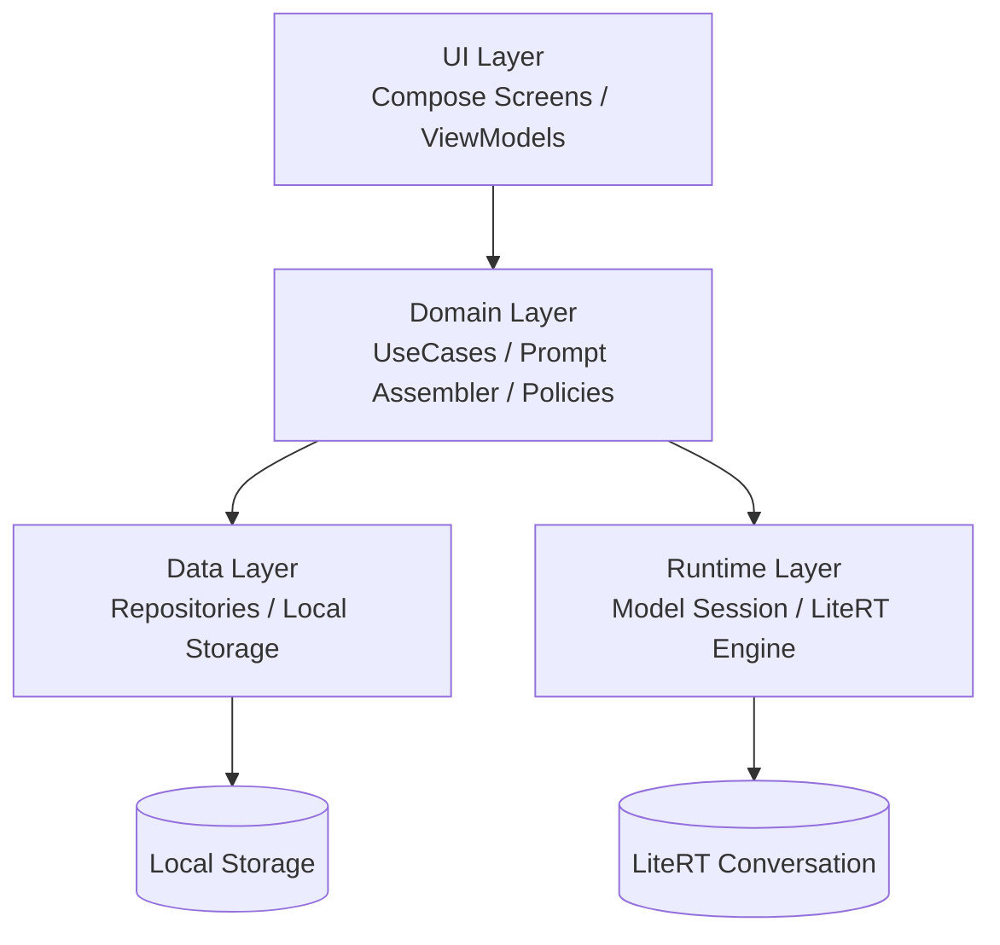
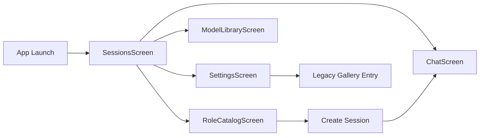
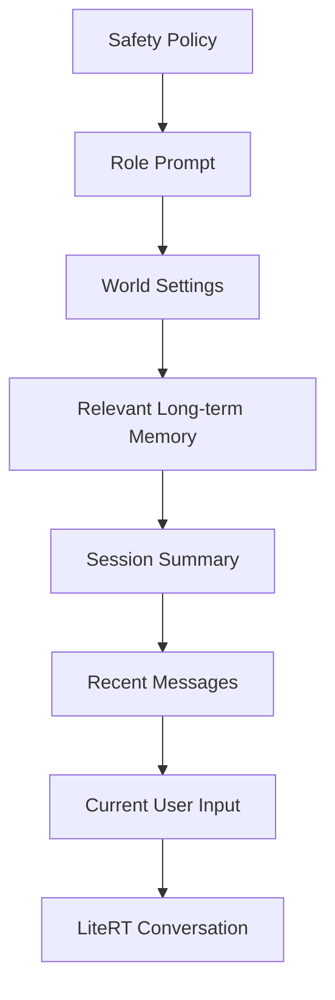

# 本地 Roleplay 聊天 App 改造方案

## 文档信息

- 状态：方案草案 v1
- 日期：2026-04-05
- 适用范围：Android 第一阶段改造
- 目标：基于现有 AI Edge Gallery Android 基建，将展示型 gallery/task 应用改造成可离线运行的本地 roleplay 聊天 app
- 实现级规格：见 [local-roleplay-chat-app-development-spec.md](./local-roleplay-chat-app-development-spec.md)

## 1. 目标与边界

### 1.1 改造目标

本次改造的目标不是在现有 gallery 中简单追加一个聊天页面，而是把应用的产品中心从 task 展示切换为会话驱动的角色聊天。第一阶段以 Android 为唯一落地目标，要求尽可能复用现有 Compose、LiteRT、模型管理与 Hilt 注入链路，同时保证完全本地离线。

应用层目标聚焦五个核心能力：

1. 交互逻辑从 task 选择改为角色与会话驱动。
2. 聊天记录从内存态升级为可恢复、可管理、可导出的本地持久化数据。
3. 模型加载逻辑从“页面选择模型”升级为“角色默认模型 + 会话活跃模型”的运行时策略。
4. Roleplay 角色信息具备独立的数据模型、编辑入口和 prompt 装配能力。
5. 记忆系统拆分为短期上下文压缩和长期事实记忆，支撑多轮剧情延续。

### 1.2 第一阶段明确不做

第一阶段不包含以下内容：

- 云同步
- 多人/多角色群聊
- 向量数据库与 embedding 检索
- 以 WebView skill 为主的角色聊天容器
- iOS 同步交付
- 在线 API 依赖型角色逻辑

### 1.3 已确认的设计决策

- 产品主方向：专用原生聊天应用，不再以 skill 容器作为主路径。
- 运行方式：完全本地离线。
- 记忆方案：第一版采用摘要与事实卡片，不直接上向量检索。
- 平台策略：Android 先落地，领域层与数据模型按未来可移植方式设计。
- skill 定位：保留为未来可插拔工具层，不承担主会话、主记忆和主导航。
- 打包策略：本项目按“新应用”处理，不复用原应用的包名、跳转 scheme、第三方配置、通知渠道和产品标识。
- 当前暂定新包名：`selfgemma.talk`。

## 2. 现状基线与约束

### 2.1 当前项目里已经可以复用的部分

现有仓库已经具备一套很适合复用的基础能力：

- 导航容器：`GalleryNavHost` 位于 `Android/src/app/src/main/java/com/google/ai/edge/gallery/ui/navigation/GalleryNavGraph.kt`
- 首页容器：`HomeScreen` 位于 `Android/src/app/src/main/java/com/google/ai/edge/gallery/ui/home/HomeScreen.kt`
- 聊天 UI 外壳：`LlmChatScreen` 位于 `Android/src/app/src/main/java/com/google/ai/edge/gallery/ui/llmchat/LlmChatScreen.kt`
- 消息状态容器：`ChatViewModel` 位于 `Android/src/app/src/main/java/com/google/ai/edge/gallery/ui/common/chat/ChatViewModel.kt`
- 模型下载与初始化：`ModelManagerViewModel` 位于 `Android/src/app/src/main/java/com/google/ai/edge/gallery/ui/modelmanager/ModelManagerViewModel.kt`
- LiteRT 对话运行时：`LlmChatModelHelper` 位于 `Android/src/app/src/main/java/com/google/ai/edge/gallery/ui/llmchat/LlmChatModelHelper.kt`
- 配置持久化：`DataStoreRepository` 和 `AppModule`

### 2.2 当前架构的关键问题

当前架构不适合直接承载 roleplay 聊天，根因不是 UI 不够，而是状态模型不对。

主要问题如下：

1. 聊天消息当前按 `model.name` 挂在内存 map 中，而不是按 `sessionId` 挂载，导致消息与真实会话没有稳定绑定。
2. 聊天记录没有落盘，应用重启后无法恢复剧情上下文。
3. 角色、会话、记忆三类核心对象在当前工程里不存在统一模型。
4. `DataStoreRepository` 更适合轻量设置与小体量 proto 数据，不适合高频追加的聊天历史。
5. skill 体系通过 WebView 执行脚本，适合作为工具调用层，不适合作为主会话容器。

### 2.3 现阶段约束

- 现有 Android 端没有数据库依赖，若要承载会话和记忆，需要新增存储方案。
- 现有会话运行时与 LiteRT conversation 强绑定，切换模型或重置会话时要谨慎处理生命周期。
- 当前首页与导航以 task 为中心，重构时必须考虑对旧入口的兼容策略。
- 仓库根 README 提到 iOS 发行版本，但当前工作区没有现成 iOS 客户端代码，因此第一阶段不能按双端实施来设计交付路径。
- 当前工程存在原产品标识残留，包括 `namespace = com.google.ai.edge.gallery`、`applicationId = com.google.aiedge.gallery`、Manifest deep link scheme、Firebase/FCM 配置入口、DataStore 文件名、模型导入目录和应用文案；如果不先做隔离，会在发布和本地并装阶段留下隐患。

## 3. 目标产品形态

### 3.1 信息架构

第一阶段建议把应用信息架构改成四个主入口：

1. 会话：查看、恢复、归档、删除会话。
2. 角色：查看内置角色、创建角色、编辑角色、导入角色。
3. 模型：管理已下载模型、导入模型、选择默认模型。
4. 设置：全局配置、存储管理、导出导入、实验开关。

旧 gallery/task 首页不立即删除，而是作为次级入口保留在设置页或实验入口中。

### 3.2 核心用户流

核心路径应收敛为：

1. 打开 App。
2. 进入会话页或角色页。
3. 选择一个角色，创建新会话。
4. 会话页加载该角色默认模型与角色 prompt。
5. 用户发送消息。
6. 系统装配 prompt 上下文，执行本地推理。
7. 回复完成后更新短期摘要与长期记忆。
8. 会话在本地持久化，可随时恢复。

### 3.3 页面结构建议

```text
App
├─ SessionsScreen
│  ├─ SessionList
│  ├─ SessionFilter
│  └─ SessionActions
├─ RoleCatalogScreen
│  ├─ BuiltInRoles
│  ├─ UserRoles
│  └─ ImportRole
├─ RoleEditorScreen
├─ ChatScreen
│  ├─ Header: role/model/session status
│  ├─ MessageList
│  ├─ MemoryHintsBar
│  └─ MessageInput
├─ ModelLibraryScreen
└─ SettingsScreen
```

## 4. 总体架构设计

### 4.1 推荐分层

建议把改造后的 Android 端划成四层：



各层职责如下：

- UI Layer：负责页面状态、交互响应、消息渲染、用户动作分发。
- Domain Layer：负责 prompt 组装、会话策略、记忆提取、模型选择策略。
- Data Layer：负责角色、会话、消息、记忆、设置的本地读写。
- Runtime Layer：负责模型实例生命周期、conversation reset、推理调用、取消与恢复。

### 4.2 与当前工程的映射关系

- 保留并复用：`ModelManagerViewModel`、`LlmChatModelHelper`、`ChatView`、`LlmChatScreen` 的 UI 基础。
- 局部改造：`ChatViewModel`、`LlmChatViewModel` 从按模型缓存状态改成按会话加载状态。
- 新增模块：会话仓储、角色仓储、记忆仓储、prompt 装配器、聊天编排器。
- 弱化模块：`AgentChatScreen` 和 `AgentTools` 作为未来工具层保留，但不作为主路径。

## 5. 详细逻辑设计

### 5.1 交互逻辑

#### 5.1.1 导航重构策略

当前导航是 `HomeScreen -> Model List -> Task Screen`。改造后应切换为：



改造原则：

1. 首页默认进入会话列表，而不是功能列表。
2. 新建会话可以从角色页发起，也可以从会话页右上角发起。
3. 模型库从聊天主流程中解耦，聊天页只做模型选择和状态展示，不承担模型管理全流程。
4. 旧 gallery/task 入口作为 secondary route 暂时保留，避免一次重构影响全部场景。

#### 5.1.2 会话页交互逻辑

会话页应包含以下能力：

- 按最近更新时间排序
- 角色过滤
- 模型过滤
- 收藏/置顶会话
- 归档会话
- 删除会话
- 导出会话

会话卡片建议显示：

- 角色名
- 会话标题
- 最后一条摘要
- 最后更新时间
- 当前模型
- 未完成剧情标记

#### 5.1.3 聊天页交互逻辑

聊天页复用现有消息列表和输入区，但需要新增以下状态条：

- 角色名称与头像
- 当前模型状态
- 会话记忆状态
- 摘要更新时间
- 当前回合数

发送消息的前端流程：

1. 用户输入文本或插入附件。
2. UI 立即写入用户消息到本地会话仓储。
3. ViewModel 触发聊天编排器构建本轮 prompt。
4. 编排器从会话仓储读最近消息，从记忆仓储读命中记忆，从角色仓储读角色卡。
5. Runtime 层执行推理并流式返回 token。
6. UI 显示流式响应并更新消息内容。
7. 回复结束后触发摘要更新与事实记忆提取。
8. 所有增量结果写回本地存储。

#### 5.1.4 特殊交互策略

- 角色切换：必须新建会话，不允许在旧会话中直接替换角色，否则上下文污染严重。
- 模型切换：允许在同一会话中切换，但必须写入会话事件日志，并在必要时 reset conversation。
- 中断生成：保留现有 stop 能力，但中断后也要把已生成内容安全落盘。
- 重试生成：允许基于最后一个用户输入重新生成，但应记录成新的 assistant message version 或覆盖策略。
- 长按消息：支持复制、删除、重新生成、固定为长期记忆。

### 5.2 聊天记录管理

#### 5.2.1 数据对象设计

建议最少定义以下对象：

```text
RoleCard
Session
Message
Attachment
MemoryItem
SessionSummary
PromptSnapshot
SessionEvent
```

推荐字段如下：

```kotlin
data class RoleCard(
  val id: String,
  val name: String,
  val avatarUri: String?,
  val systemPrompt: String,
  val personaDescription: String,
  val openingLine: String,
  val exampleDialogues: List<String>,
  val worldSettings: String,
  val defaultModelId: String?,
  val memoryPolicy: MemoryPolicy,
  val safetyPolicy: String,
  val tags: List<String>,
  val builtIn: Boolean,
  val updatedAt: Long,
)

data class Session(
  val id: String,
  val roleId: String,
  val title: String,
  val activeModelId: String,
  val pinned: Boolean,
  val archived: Boolean,
  val createdAt: Long,
  val updatedAt: Long,
  val lastSummary: String,
  val turnCount: Int,
)

data class Message(
  val id: String,
  val sessionId: String,
  val side: MessageSide,
  val type: MessageType,
  val content: String,
  val status: MessageStatus,
  val createdAt: Long,
  val metadataJson: String?,
)
```

#### 5.2.2 存储方案建议

推荐方案：新增数据库型本地存储承载会话、消息、角色和记忆。

原因：

- 聊天消息是高频追加写入，不适合继续堆在 `Settings` proto 中。
- 会话列表需要分页和排序。
- 消息详情需要按 `sessionId` 范围查询。
- 未来可能需要搜索、标签过滤、导出和统计。

可选落地方式：

1. 推荐：Room/SQLite
2. 保守：独立 proto 文件 + 索引文件
3. 不建议：继续扩展 `DataStoreRepository` 承载完整会话历史

第一阶段如果追求最快 MVP，可先实现最小化 proto-only 版本，但文档和接口必须按数据库型存储预留迁移层。

#### 5.2.3 Repository 设计

建议新增以下仓储接口：

```kotlin
interface ConversationRepository {
  suspend fun createSession(roleId: String, modelId: String): Session
  suspend fun getSession(sessionId: String): Session?
  suspend fun listSessions(): List<Session>
  suspend fun archiveSession(sessionId: String)
  suspend fun deleteSession(sessionId: String)
  suspend fun appendMessage(message: Message)
  suspend fun updateMessage(message: Message)
  suspend fun listMessages(sessionId: String, limit: Int, before: Long? = null): List<Message>
}

interface RoleRepository {
  suspend fun listRoles(): List<RoleCard>
  suspend fun getRole(roleId: String): RoleCard?
  suspend fun saveRole(role: RoleCard)
  suspend fun deleteRole(roleId: String)
}

interface MemoryRepository {
  suspend fun upsertMemory(memory: MemoryItem)
  suspend fun listMemories(roleId: String, sessionId: String?): List<MemoryItem>
  suspend fun searchRelevantMemories(roleId: String, query: String): List<MemoryItem>
  suspend fun pinMemory(memoryId: String, pinned: Boolean)
}
```

#### 5.2.4 聊天记录生命周期

记录管理应采用“先写本地，再推理”的策略：

1. 用户消息先入库。
2. assistant 占位消息先入库，状态为 `STREAMING`。
3. 流式 token 过程中持续更新该消息。
4. 生成结束后将状态改为 `COMPLETED`。
5. 如果中断或错误，则保留部分内容并标记状态为 `INTERRUPTED` 或 `FAILED`。

该策略的好处是应用崩溃后仍可恢复最近一次对话状态，不会丢失整轮内容。

### 5.3 模型加载逻辑

#### 5.3.1 模型管理层定位

现有 `ModelManagerViewModel` 已经负责：

- allowlist 拉取
- 模型下载
- 导入/删除模型
- 初始化状态
- 文本输入历史

这部分不需要推倒重写，应继续作为“模型资产管理层”。

#### 5.3.2 目标模型运行时结构

建议在现有 `LlmChatModelHelper` 上方新增一个 `RuntimeSessionManager`，专门处理“会话与模型”的绑定关系。

```text
UI/ViewModel
  -> ChatOrchestrator
    -> RuntimeSessionManager
      -> ModelManagerViewModel
      -> LlmChatModelHelper
```

`RuntimeSessionManager` 的职责：

- 根据会话拿到当前 active model
- 判断该模型是否已初始化
- 决定是否重用已有 conversation
- 在角色变更、模型切换、摘要重构后决定是否 reset
- 管理后台回收与前台恢复

#### 5.3.3 会话与模型绑定策略

每个会话应持有一个 `activeModelId`，来源优先级如下：

1. 会话显式指定模型
2. 角色默认模型
3. 全局默认模型

模型切换规则：

- 切换模型后立即更新会话记录
- 写入一条系统事件消息，标识模型已变更
- 销毁旧 conversation 或放入缓存池
- 为新模型重新构建 conversation

#### 5.3.4 初始化和释放策略

建议采用“单活跃 + 可选预热”的保守策略：

- 当前仅保持一个活跃会话对应的 conversation
- 最近一个会话可以进入预热候选
- 应用切后台时释放非必要实例
- 内存紧张时优先保留当前活跃会话模型

原因是当前工程对模型实例生命周期较敏感，而 roleplay 聊天更依赖稳定性，不应一开始就做多实例并发。

#### 5.3.5 推理前 prompt 装配逻辑

本地 roleplay 的推理输入建议按如下顺序装配：

1. 安全前置规则
2. 角色系统提示
3. 世界观/角色设定
4. 长期记忆命中结果
5. 会话摘要
6. 最近若干轮原始消息
7. 当前用户输入

可表达为：



### 5.4 Roleplay 角色信息设计

#### 5.4.1 角色数据结构

角色是主业务对象，不能继续借用 skill 的元数据结构。角色卡至少要包含：

- 基础信息：名称、头像、简介、标签
- Prompt 信息：系统提示、说话风格、世界观、示例对话、禁忌项
- 运行时偏好：默认模型、默认采样参数、是否启用思维链展示
- 记忆策略：摘要阈值、长期记忆提取开关、记忆上限
- 展示信息：开场白、推荐场景、封面图

#### 5.4.2 角色来源

建议支持三类角色：

1. 内置角色：随 apk 打包分发
2. 用户自建角色：保存在本地数据库
3. 导入角色：从本地文件导入到用户角色库

内置角色资产可以借鉴 `skills/` 和 Android assets 的打包方式，但角色本体仍应作为原生数据模型读入，而不是用 SKILL.md 驱动。

#### 5.4.3 角色编辑器逻辑

角色编辑页建议采用分组编辑：

- 基础信息
- 人设与世界观
- 对话风格
- 默认模型与参数
- 记忆策略
- 预览开场白

编辑器需要支持：

- 实时预览 prompt
- 角色导出
- 角色复制
- 表单校验
- 风险字段提醒

### 5.5 短期与长期记忆设计

#### 5.5.1 记忆分层原则

短期记忆和长期记忆不能混成一层，否则会同时失控在 token 成本和一致性两个维度。

推荐分层：

- 短期记忆：服务当前 session，重点是压缩上下文窗口
- 长期记忆：服务角色与剧情延续，重点是抽取稳定事实

#### 5.5.2 短期记忆策略

短期记忆使用“最近消息 + 滚动摘要”组合：

- 最近消息保留最近 N 轮原始对话
- 超出阈值后，将较早消息压缩成 `SessionSummary`
- 摘要更新触发条件可以是回合数阈值、token 估算阈值或手动触发

建议第一阶段规则：

- 保留最近 8 到 12 轮原始消息
- 每 6 轮触发一次摘要更新
- 摘要更新后覆盖旧摘要，不保留多版本

#### 5.5.3 长期记忆策略

长期记忆不做全文保留，而是做结构化事实卡片。

建议分类：

- 用户偏好
- 角色关系
- 世界设定
- 关键剧情节点
- 未完成任务/伏笔
- 永久设定与禁忌

建议字段：

```kotlin
data class MemoryItem(
  val id: String,
  val roleId: String,
  val sessionId: String?,
  val category: MemoryCategory,
  val content: String,
  val confidence: Float,
  val pinned: Boolean,
  val sourceMessageIds: List<String>,
  val createdAt: Long,
  val updatedAt: Long,
)
```

#### 5.5.4 记忆提取逻辑

每轮生成结束后，执行轻量记忆提取流程：

1. 读取本轮 user/assistant 消息对。
2. 基于规则或轻量 prompt 识别是否出现可沉淀信息。
3. 转成结构化 `MemoryItem`。
4. 与现有记忆做去重和冲突合并。
5. 写回本地仓储。

第一阶段建议以规则和模板驱动为主，例如：

- 明确偏好句式
- 明确关系句式
- 事实更新句式
- 明确任务状态句式

这样做的原因是完全离线场景下，记忆提取本身也占用模型资源，第一版应优先控制成本和稳定性。

#### 5.5.5 记忆检索逻辑

检索规则建议按以下顺序进行：

1. 角色维度过滤
2. 会话维度过滤
3. pinned 记忆优先
4. 与当前输入关键词命中
5. 高置信度优先
6. 最近更新时间优先

最终只注入少量最相关记忆，避免 prompt 过长和角色行为漂移。

## 6. 建议新增的代码组织方式

下面给出推荐目录结构，不要求一次性全部创建，但建议按这个边界拆：

```text
Android/src/app/src/main/java/selfgemma/talk/
├─ feature/roleplay/
│  ├─ sessions/
│  ├─ roles/
│  ├─ chat/
│  ├─ memory/
│  └─ settings/
├─ domain/roleplay/
│  ├─ model/
│  ├─ repository/
│  ├─ usecase/
│  └─ prompt/
├─ data/roleplay/
│  ├─ local/
│  ├─ mapper/
│  └─ repository/
└─ runtime/roleplay/
   └─ RuntimeSessionManager.kt
```

### 6.1 应优先改造的现有文件

- `Android/src/app/src/main/java/com/google/ai/edge/gallery/ui/navigation/GalleryNavGraph.kt`
- `Android/src/app/src/main/java/com/google/ai/edge/gallery/ui/home/HomeScreen.kt`
- `Android/src/app/src/main/java/com/google/ai/edge/gallery/ui/common/chat/ChatViewModel.kt`
- `Android/src/app/src/main/java/com/google/ai/edge/gallery/ui/llmchat/LlmChatViewModel.kt`
- `Android/src/app/src/main/java/com/google/ai/edge/gallery/ui/llmchat/LlmChatScreen.kt`
- `Android/src/app/src/main/java/com/google/ai/edge/gallery/ui/modelmanager/ModelManagerViewModel.kt`
- `Android/src/app/src/main/java/com/google/ai/edge/gallery/di/AppModule.kt`

### 6.2 建议新增的关键文件

```text
domain/roleplay/model/RoleCard.kt
domain/roleplay/model/Session.kt
domain/roleplay/model/Message.kt
domain/roleplay/model/MemoryItem.kt
domain/roleplay/repository/ConversationRepository.kt
domain/roleplay/repository/RoleRepository.kt
domain/roleplay/repository/MemoryRepository.kt
domain/roleplay/prompt/PromptAssembler.kt
domain/roleplay/usecase/SendMessageUseCase.kt
domain/roleplay/usecase/UpdateSessionSummaryUseCase.kt
domain/roleplay/usecase/ExtractMemoryUseCase.kt
runtime/roleplay/RuntimeSessionManager.kt
feature/roleplay/chat/RoleplayChatViewModel.kt
feature/roleplay/chat/RoleplayChatScreen.kt
feature/roleplay/roles/RoleCatalogScreen.kt
feature/roleplay/sessions/SessionsScreen.kt
```

## 7. 分阶段实施计划

### Phase -1：新包隔离与打包基线

目标：在任何 feature 开发之前，把当前工程从原产品标识中切出来，形成独立 app 身份。

工作项：

- 替换 namespace、applicationId、Manifest package 与 deep link scheme，统一落到 `selfgemma.talk` 体系
- 替换应用名称、通知 channel id、下载通知文案、Application 类名、FCM Service 类名
- 替换本地存储命名，包括 DataStore 文件名、数据库名、模型导入目录、allowlist 缓存文件名
- 决定 Firebase 策略：接入新的 Firebase 项目，或在 roleplay 版本中完全移除 Firebase 依赖与相关 Manifest 节点
- 使用新的签名 key 与发布配置，确保可以与原版并装

建议在这一阶段把以下命名一并固定：

- 应用显示名：`SelfGemma Talk`
- deep link scheme：`selfgemma.talk`
- OAuth redirect scheme：`selfgemma.talk.auth`
- 本地存储前缀：`selfgemma_talk`

具体逐文件修改清单见 [pr0-selfgemma-talk-package-migration-checklist.md](./pr0-selfgemma-talk-package-migration-checklist.md)


验收标准：

- 新包可以与原版应用同时安装
- 新包不会命中原版 deep link、provider authority、OAuth redirect scheme 或 Firebase 工程
- 本地缓存、导入目录与密钥命名全部统一到 `selfgemma_talk` / `selfgemma.talk` 体系

### Phase 0：冻结产品边界

交付物：

- 角色聊天第一版范围定义
- MVP 页面列表
- 是否引入数据库存储的最终决策

验收标准：

- 产品边界不再摇摆
- 角色、会话、记忆、模型四大对象责任清晰

### Phase 1：重构应用壳与导航

目标：把首页从 task gallery 改造成会话化入口。

工作项：

- 新增 SessionsScreen、RoleCatalogScreen、SettingsScreen 路由
- 调整 `GalleryNavHost` 默认入口
- 保留 legacy gallery route

验收标准：

- 启动后默认进入会话页
- 旧 task 流程仍可通过 secondary entry 进入

### Phase 2：定义领域模型与仓储接口

目标：建立会话驱动的数据边界。

工作项：

- 定义 RoleCard、Session、Message、MemoryItem
- 定义 ConversationRepository、RoleRepository、MemoryRepository
- 建立 mapper 与 use case 边界

验收标准：

- ViewModel 不再直接依赖旧的 `messagesByModel`
- prompt 组装所需的对象结构齐全

### Phase 3：建立持久化层

目标：把会话、角色、记忆从内存态升级为本地持久化。

工作项：

- 引入本地会话存储实现
- 为角色与记忆建立本地表或等价存储结构
- 在 `AppModule` 里完成依赖注入

验收标准：

- 会话重启后可恢复
- 删除会话、归档会话、编辑角色可正常落盘

### Phase 4：聊天编排改造成会话驱动

目标：重写发送链路，让 prompt 组装基于角色、记忆和会话。

工作项：

- 新增 `PromptAssembler`
- 新增 `SendMessageUseCase`
- 对接 `RuntimeSessionManager`
- assistant 流式消息落盘

验收标准：

- 发送链路可读取 sessionId 对应的数据
- 切后台后恢复消息不丢失

### Phase 5：模型加载逻辑收敛

目标：让模型切换和 conversation 生命周期服从会话状态。

工作项：

- 引入 `activeModelId`
- 统一模型切换、会话 reset、角色切换逻辑
- 增加后台释放策略

验收标准：

- 切换模型后会话行为可预期
- 多次进入退出聊天页不会造成实例泄漏

### Phase 6：角色资料体系落地

目标：形成完整的角色管理能力。

工作项：

- 内置角色加载
- 用户角色新建/编辑/删除
- 角色导入导出

验收标准：

- 角色可以独立创建并驱动新会话
- 角色参数能影响 prompt 和模型选择

### Phase 7：短期与长期记忆落地

目标：建立剧情连续性。

工作项：

- 会话摘要生成
- 事实记忆提取与去重
- 记忆检索与注入
- pinned memory 交互

验收标准：

- 长会话中剧情不明显断裂
- 关键事实在后续轮次中可回忆

### Phase 8：兼容旧能力与工具扩展

目标：保留旧 gallery 和 skill 的后路。

工作项：

- 旧入口降级保留
- 预留 AgentTools 作为未来角色工具层

验收标准：

- 旧模型管理与 skill 功能不被主链路重构破坏

### Phase 9：验证与上线门槛

目标：保证稳定性与可持续演进。

重点验证：

- 离线冷启动
- 首次模型加载
- 会话恢复
- 模型切换
- 摘要更新
- 记忆命中
- 长会话性能
- 导入导出
- 异常恢复

## 8. MVP 收缩建议

如果需要先做一个尽快可跑的版本，建议 MVP 范围如下：

- 只支持文本 roleplay
- 只支持单角色单人会话
- 只支持会话列表、角色列表、聊天页、模型库、设置页
- 短期记忆仅做最近消息 + 单摘要
- 长期记忆仅做 pinned facts 和手动添加
- 角色编辑先做文本字段，不做复杂头像裁剪和模板市场

这样可以优先验证三件事：

1. 会话状态是否稳定
2. 角色 prompt 是否足够驱动差异化表现
3. 本地记忆是否真的提升连续体验

## 9. 风险点与规避策略

### 9.1 风险：会话状态仍然绑在模型上

规避：尽早把 `messagesByModel` 改为 `sessionId` 驱动，不要在旧状态模型上继续追加逻辑。

### 9.2 风险：持久化方案过晚决策

规避：在 Phase 0 就明确是数据库型存储还是 proto-only MVP，避免 Phase 4 再返工状态层。

### 9.3 风险：记忆提取成本过高

规避：第一版只做轻量规则提取与 pinned memory，不让记忆流水线成为额外的大模型任务。

### 9.4 风险：角色与 skill 混用造成职责混乱

规避：角色永远是原生业务对象，skill 只作为工具层，不作为角色或主对话容器。

### 9.5 风险：模型实例泄漏

规避：通过 `RuntimeSessionManager` 统一管理初始化、reset、stop、cleanup，避免页面层直接拼接生命周期逻辑。

## 10. 建议的近期落地顺序

建议按下面顺序推进，避免 UI 先行导致底层返工：

1. 先完成新包隔离与打包基线。
2. 再确定持久化方案与领域模型。
3. 改造导航与首页。
4. 建立会话仓储和角色仓储。
5. 把聊天发送链路改成 session 驱动。
6. 接入角色卡与默认模型逻辑。
7. 再上短期摘要和长期事实记忆。
8. 最后处理旧 gallery/skill 的兼容入口。

## 11. 最终结论

这个项目最适合的改造路径，不是继续围绕 skill/gallery 做扩展，而是把现有 Android 基建重新组织为一个“会话驱动、角色驱动、完全离线”的本地 roleplay 聊天产品。现有代码最大的可复用价值在于聊天 UI、模型管理和 LiteRT 运行时；最大的必须重构点在于状态模型、持久化边界和 prompt 编排链路。

如果后续要继续推进实现，下一步应先产出两份补充设计：

1. 角色、会话、记忆的 schema 细化稿
2. Android 侧具体文件改造清单与任务拆解稿